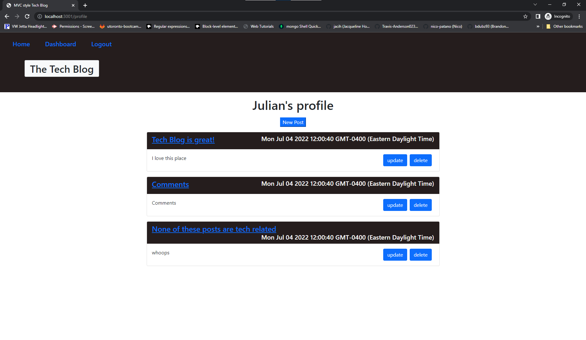

# Tech Blog 

## Description

### What does Tech Blog do?

This is a full stack website that allows users to share and comment on posts.

https://mvc---tech-blog.herokuapp.com/


## Table of Contents

- [Installation](#installation)
- [Usage](#usage)
- [Credits](#credits)
- [Contribution](#contribution)
- [Questions](#questions)
- [Licence](#licence)

---

## Installation 

### Technologies Used in Development

Technologies used include:

This project follows the model view controller architecture. The models are handled by mysql2 and sequelize, the views are created in html and rendered using handlebars, and the controllers are the api routes handled by express. The bcrypt and dotenv packages are used for user security, and express-session is used to store user login info and allow access to certain routes only if the user is logged in.

### Installation Instructions

```md
mysql -u root -p, (login with your information)
source ./db/schema.sql; in the root to setup the database.
create a .env file with your info
npm run seed to seed the database with basic info
npm run start to start the server.
```

## Usage

https://mvc---tech-blog.herokuapp.com/



```md
signup with made up user info or use one of the seed logins and enjoy!
```

## Credits

Front and backend was written by me.

## Contribution

Guidelines for contribution:

no contribution

## Questions

no contact please

https://github.com/jq67

---
## Licence
This project is covered under the `Mit License`
